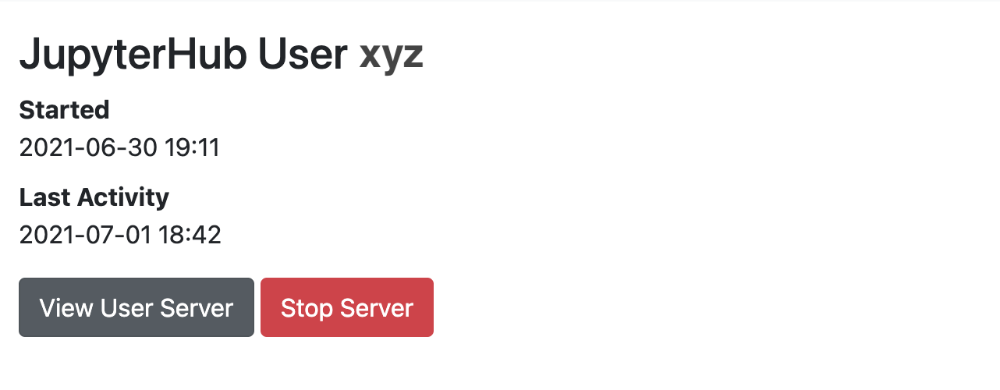

=========
Hub Admin
=========

When a user logs in to a JupyterHub the first time, they are registered as a user on
the JupyterHub. At this point, their activity can be viewed through **Hub Admin** and
you may perform administrative actions on their Notebook server.

You may sort the list of users by clicking the arrows at the top of each column on
the table. Users that are listed as *Inactive* do not have a running Notebook server.
Users that have running Notebook servers will show timestamps for their activity.
To view a user, click on their name. When viewing an active user, you will see a
screen that may look like this:

Viewing a User's Server
=======================

By clicking the **View User Server** button, you will be taken to the user's active Notebook 
server. You are logged in to their server *as that user* using a token for authorization.
From here, you may perform any action normally available to that user on their behalf, such
as opening terminals, starting notebooks or shutting down the server.

Stopping a Server
=================

Sometimes it is necessary to stop a Notebook server on behalf of the user. By clicking the
**Stop Server** button, the user's Notebook server will shut down. It may take some time
for the operation to complete.
