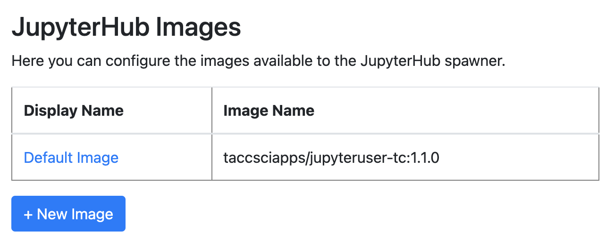
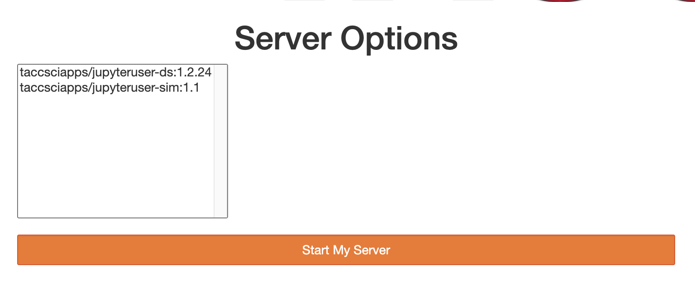
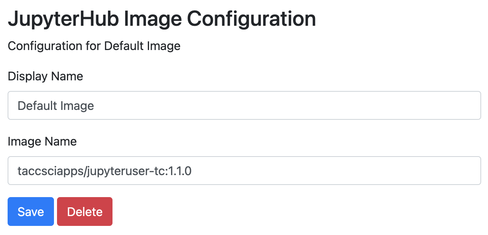

==========
Hub Images
==========

JupyterHub images are Docker images that are used to spawn a user's JupyterHub notebook server.
Users may select any image that is available on your JupyterHub to spawn their notebook server.
Images can be built to offer different Python packages or other customizations.

When a user logs in to a JupyterHub, **if there is more than one image available** they will
be prompted to select an image to be used to start their notebook server. It may appear like this:

Adding or Editing Images
========================

To add a new image option, click the **+ New Image** button. Alternatively, to edit or delete
an existing image option, click on its name in the table.

When editing an image option, the **Display Name** is the name that is shown in the Server Options
prompt in the server spawner. The **Image Name** is the Docker image name used to for this 
server option.