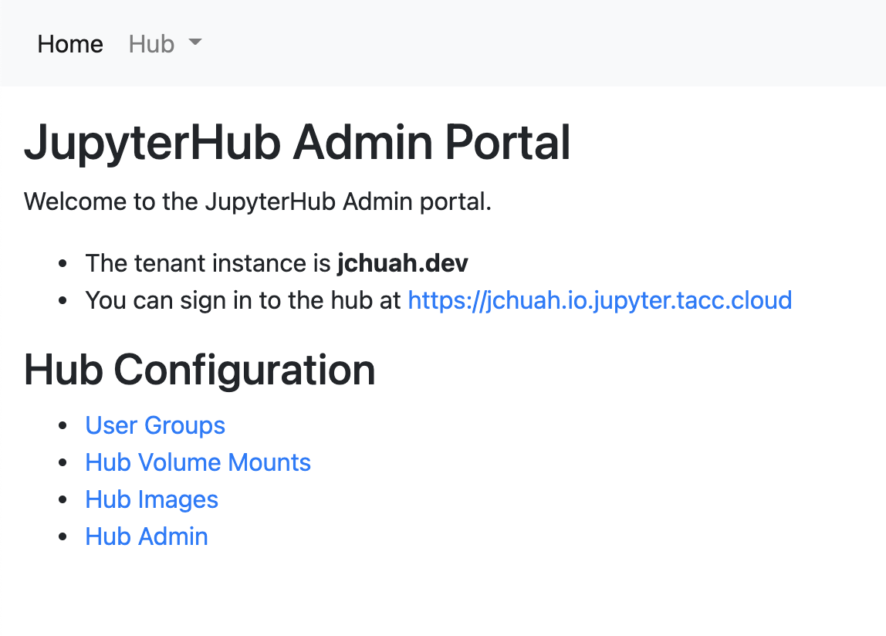

=====================
Administration Portal
=====================

SCINCO JupyterHubs include an administrative portal. This interface allows Hub administrators
to perform tasks such as:

* Starting and stopping servers on behalf of users
* Adding volume mounts to a Hub
* Adding custom images to a Hub
* See the list of users on the Hub 
* Configure user groups for the Hub

If you are a PI and would like to control administrative functions on your SCINCO JupyterHub,
please file a ticket for TACC staff to add you as an administrator.

Accessing the Administration Portal
===================================

TACC staff can add a user to the Administration Portal instance that is running in Kubernetes.
Typically, Administration Portals are available at ``https://<portal_name>-admin.io.jupyter.tacc.cloud``.
You will be prompted for your TACC username and password. If you have been granted access to
the Administration Portal, you can log in and make alterations to the JupyterHub

Using the Administration Portal
===============================

Once you have successfully logged in, you will see the main page:

From here, you may choose the following options:

* :doc:`./usergroups`
* :doc:`./mounts`
* :doc:`./images`
* :doc:`./hubadmin`

.. warning::
   The JupyterHub must be restarted by TACC staff before any configuration changes will appear.