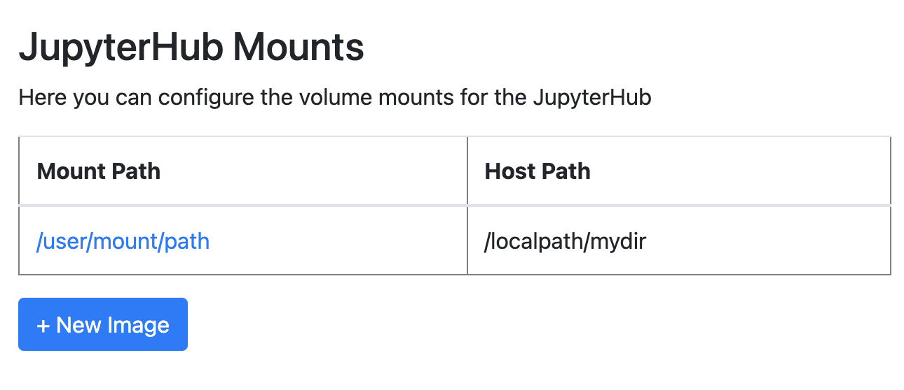
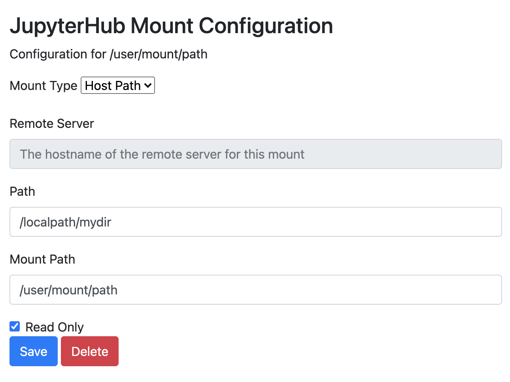
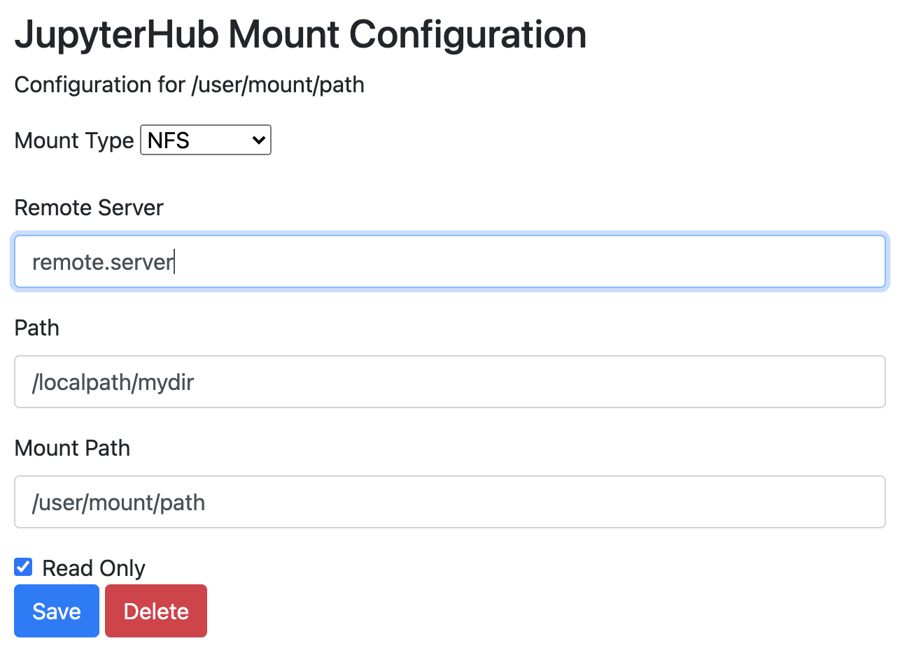

=================
Hub Volume Mounts
=================

Volume mounts allow a user to access file system data from within their JupyterHub server.
Volume mounts can either be data that is locally available on the Kubernetes node running
the server or an external NFS mount.

Adding or Editing Images
========================

To add a new mount, click the **+ New Mount** button. Alternatively, to edit or delete
an existing mount, click on its name in the table. When creating a mount, select a **Mount Type**
of either **Host Path** or **NFS**.

Configuring a Host Path Mount
=============================

A Host Path mount is a Notebook Server mount to a file system location on the node
that is hosting the server. For host paths to be available as mount options, they must
be configured by TACC staff. If you would like a new host path mount, you must file
a ticket requesting the host path before making configuration changes in the Administration
Portal.

The **Remote Server** option is disabled for Host Path mounts. The **Path** option is the
file system path on the host node that will be mounted. The **Mount Path** option is the path
as it appears in a user's Notebook server. The **Read Only** option restricts a user's
Notebook server write access to that path.

Configuring an NFS Mount
========================

An NFS mount is a Notebook Server mount to a remote file system that has been exported
via NFS. If you would like to configure an NFS mount, you must file a ticket to verify that
an NFS export has been configured before making configuration changes in the Administration
Portal.

The configuration options here are similar to those available when configuring a Host Path
mount, except that you may now specify an address for the **Remote Server**. It does not
need to be prefixed with ``nfs://``.