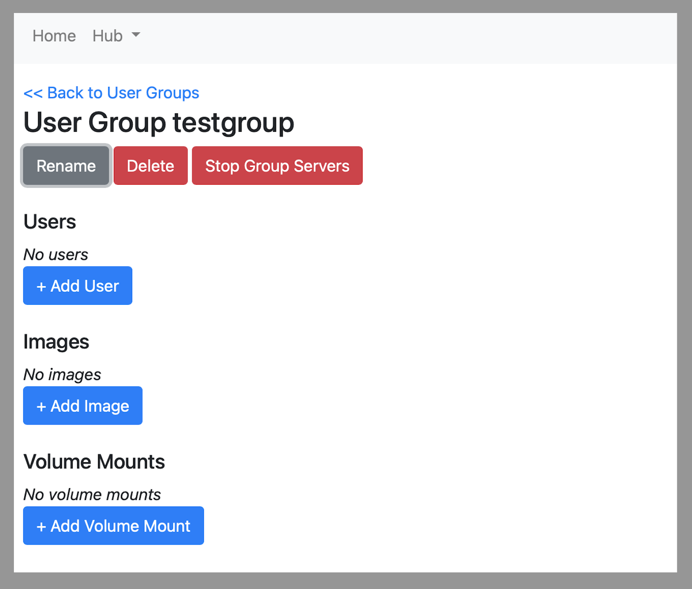

===========
User Groups
===========

User Groups provide a way for JupyterHub administrators to control user access to specific
server images and volume mounts based on group membership. When accessing this part
of the Administration Portal, you should see a list of groups for JupyterHub.

You can create a new User Group by clicking the **+ New User Group** button. You will
be prompted for a name for this group:

Alternatively, to edit an existing group you can click on the group name in the table.

Editing a User Group
====================

When editing a user group, you may control who has access to this group, what images
the group has in addition to global JupyterHub images, and what volume mounts will
be available in addition to global JupyterHub volume mounts.

You may add a username to this group by clicking the **+ Add User** button. Alternatively,
you may remove a user by clicking on the username in the group and clicking the **Delete**
button.

Adding images and volume mounts follow a process that are similar to how global JupyterHub
images and mounts are added. Please see the following:

* :doc:`./images`
* :doc:`./mounts`